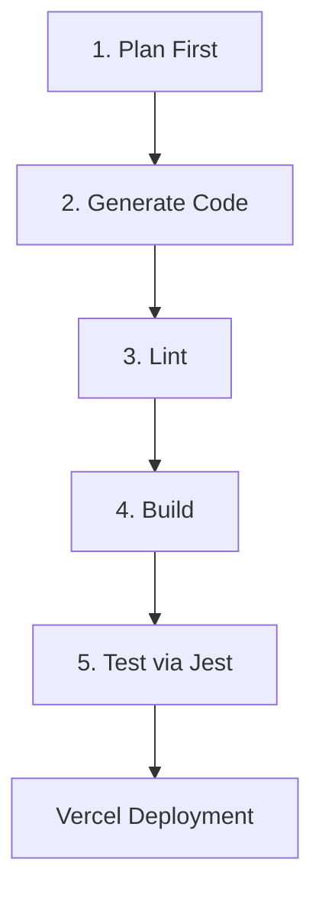

# AI Agent Guidelines (AGENT.MD)

Welcome to the **Ido Tanne Developer Portfolio** project. This file serves as the definitive guide for any AI Agent working on this codebase to ensure they operate at the highest standards of code quality, security, accessibility, and visual excellence.

---

## 1. Project Overview
- **Developer Profile**: Ido Tanne (Full-Stack Web Developer specializing in React, Next.js, .NET, PostgreSQL/MSSQL, and AI agent/MCP development).
- **Tech Stack**: Next.js (Pages Router), React 19, Tailwind CSS v4, PostCSS, ESLint, and Jest for testing.
- **Target Deployment**: Vercel.

---

## 2. Essential Antigravity Skills

To maintain state-of-the-art implementation quality, the following skills from the Antigravity Skills catalog are required. **Note**: If any required skill is not found locally under `.agents/skills`, you must pull it from the `antigravity-awesome-skills` repository (`https://github.com/sickn33/antigravity-awesome-skills`):

### UI & UX Excellence
- **`ui-ux-pro-max`**: Design guide for layout structure, typography hierarchy, curated HSL color palettes, spacing discipline, and premium visual styling.
- **`uxui-principles`**: Evaluates interfaces against 168 research-backed UX/UI principles, detects anti-patterns, and maintains design consistency.

### Live Context & Documentation
- **`context7-auto-research`**: Automatically queries and pulls the latest library/framework documentation via the Context7 API to keep library versions and API usage up to date.

### Linting & Validation
- **`lint-and-validate`**: Mandatory verification after *every* code change to guarantee that linting errors are resolved before ending a task.
- **`vibecode-production-qa-validator`**: Pre-deployment QA validator for full-stack Next.js apps, checking TypeScript, build integrity, and metadata config.

### Security Hardening
- **`cc-skill-security-review`**: Audits codebase changes for security issues, checking authentication, role-based access, and client/server boundaries.
- **`security-scanning-security-sast`**: Runs static application security testing to detect code-level vulnerabilities before git commits.
- **`security-scanning-security-dependencies`**: Monitors dependencies for known CVEs and supply-chain vulnerabilities.

### Accessibility (a11y)
- **`wcag-audit-patterns`**: Audits web content against WCAG 2.2 accessibility standards, ensuring inclusive design.
- **`accesslint-audit`**: Automatically detects and remediates access issues like missing labels, poor color contrast, and incorrect keyboard focus.

### Web Development & Frameworks
- **`react-best-practices`**: React & Next.js performance optimization and component maintainability.
- **`nextjs-best-practices`**: Next.js specific routing, API routes, and page optimization patterns.
- **`tailwind-patterns`**: Modern Tailwind CSS v4 styling rules, design token utilization, and responsive patterns.
- **`seo-audit`**: Technical SEO health checks, page speed optimizations, and indexing audits.
- **`senior-fullstack`**: End-to-end full-stack guidelines, structuring React pages alongside backend APIs cleanly.
- **`frontend-developer`**: React 19+ and Next.js Pages Router best practices.

### QA & Testing
- **`test-driven-development`**: Principles of Test-Driven Development (Red, Green, Refactor) specifically using Jest.
- **`test-fixing`**: Systematic workflows for identifying and repairing failing test suites.

---

## 3. Development Workflow

All development cycles MUST follow this five-stage workflow. Do not skip or bypass any stage.

### Phase 1: Plan First (Planning Mode)
- **Action**: Research the requirements and codebase state. Draft a detailed `implementation_plan.md` in the artifact directory.
- **Rule**: Include open questions and request user feedback. **Stop and wait** for explicit user approval before writing code.
- **Self-Grading Requirement**: Before presenting the plan, grade it against high-quality coding standards (define metrics such as complexity, testability, security, and performance). If the plan does not meet a passing grade, iterate and rebuild it. Repeat this self-grading loop up to 5 times. If a passing grade is still not met after 5 iterations, halt, document the issues, and request the user to validate the work.

### Phase 2: Generate Code (Execution Mode)
- **Action**: Create or modify pages/components under `src/pages` or `src/components`.
- **Guidelines**: Keep code modular, strictly type-safe, semantic, and optimized for Vercel edge runtime if applicable.

### Phase 3: Lint
- **Action**: Run the linter to verify syntax correctness and code style compliance.
- **Command**: `npm run lint`

### Phase 4: Build
- **Action**: Build the Next.js production bundle locally to guarantee that the application compiles without error.
- **Command**: `npm run build`

### Phase 5: Test (Logic Flows Only)
- **Action**: Run test suites using **Jest** to verify functional logic (e.g., API route logic, utility functions, state transitions).
- **Rule**: Do not write browser visual UI tests (e.g. Playwright UI workflows) unless explicitly requested; focus purely on code logic.
- **Command**: `npm test`
